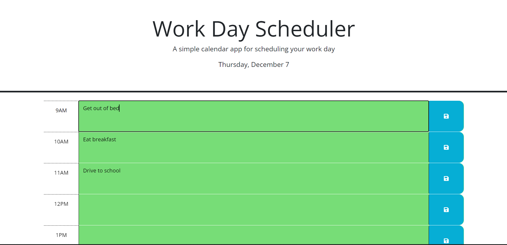

# Boudraa-Quiz-Game

## Description

This website is a workday scheduler/planner. It displays the current date and day of the week at the top of the webpage. Additionally, it colors the current hour red, past hours gray, and future hours green. Events can be entered into the colored boxes in the center and the text in them will be saved locally when the button on the right is pressed. Every time the webpage is loaded, the locally saved events will be reloaded into the text boxes.

Link to deployed webpage: https://adamboudruh.github.io/Boudraa-Work-Day-Scheduler/

